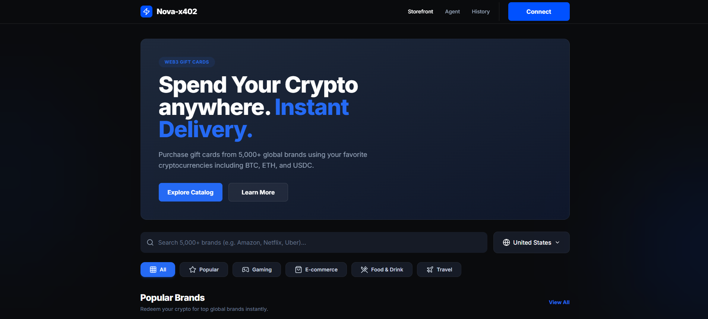
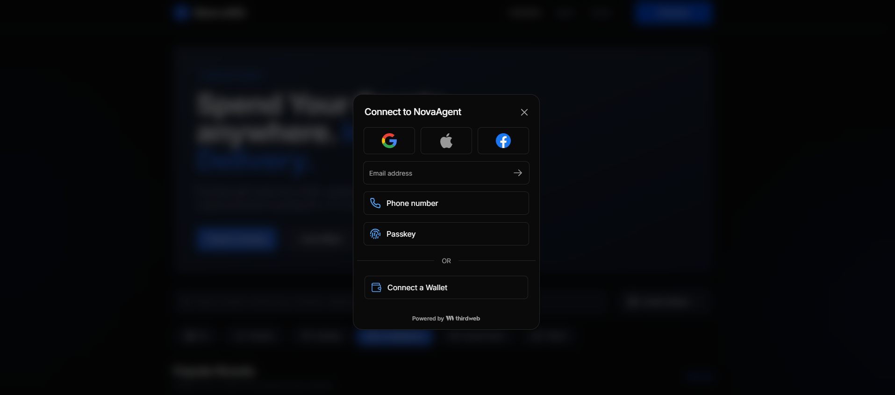
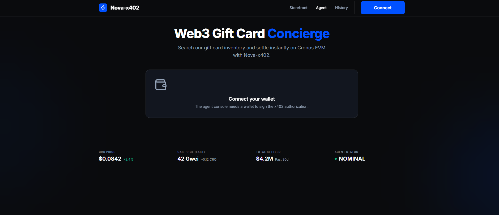

# NovaAgent - AI-Agentic Commerce with Aegis Pattern

## 🌟 NovaAgent: AI Intelligence + Smart Contract Policy + Trustworthy Autonomous Commerce

NovaAgent is a revolutionary shopping platform that combines the power of AI with blockchain-based policy controls to create secure, autonomous purchasing experiences. Built on the Cronos EVM, this project demonstrates the future of AI-agent commerce with gasless, policy-governed transactions.

### What it Does:

NovaAgent acts as an intelligent concierge for Web3 gift card purchases. It allows users to spend their crypto anywhere by purchasing gift cards from a vast catalog of global brands. The platform integrates AI agents that can autonomously negotiate and purchase on behalf of the user, all governed by smart contract policies (the "Aegis Pattern") to ensure security and adherence to user-defined rules. This enables Machine-to-Machine (M2M) payments where AI agents can execute transactions without constant human oversight, leveraging the x402 protocol for authorization.

### Key Features:

- **AI-Agentic Commerce**: Autonomous agents for gift card procurement.
- **Aegis Policy Layer**: Smart contract-based guardrails for agent behavior, including spending caps and whitelisted brands.
- **x402 Protocol Integration**: Secure, gasless authorization for M2M transactions.
- **Web3 Gift Card Concierge**: Spend crypto from your wallet at over 5,000 global brands.
- **Cronos EVM Native**: Built on Cronos for efficient and low-cost transactions.
- **User-Friendly Interface**: Intuitive design for seamless wallet connection and transaction management.

### How it Runs:

NovaAgent is a monorepo project primarily built with Next.js for the frontend and Solidity for the smart contracts (Aegis Policy Layer). The project leverages a dual-mode commerce system: a Next.js 15 storefront for human interaction and a headless x402-compliant API for autonomous AI agents.

To run the project locally:

1.  **Clone the repository:**
    ```bash
    git clone https://github.com/Virtual-Card-Cronos/nova.git
    cd nova
    ```
2.  **Install dependencies:**
    ```bash
    npm install
    ```
3.  **Set up environment variables:**
    Create a `.env.local` file in the `apps/web` directory and configure necessary variables (e.g., Supabase credentials, Cronos RPC endpoint).
4.  **Start the development server:**
    ```bash
    npm run dev
    ```
    This will typically start the frontend application on `http://localhost:3000`.

### User Interface (UI) Overview:

The NovaAgent platform features a modern, dark-themed user interface designed for clarity and ease of use. It provides a seamless experience for connecting Web3 wallets and interacting with the AI-agentic commerce system.

**1. Web3 Gift Card Concierge - Storefront:**
This view allows users to browse and purchase gift cards. It highlights the ability to "Spend Your Crypto Anywhere. Instant Delivery." with a clear call to action to explore the catalog.



**2. Wallet Connection & Agent Authorization:**
The platform offers multiple ways to connect, including traditional email/phone/passkey options and direct Web3 wallet connection. The agent console requires a wallet connection to sign x402 authorizations, enabling policy-governed transactions.



**3. Agent Console & Status:**
Once connected, the agent console provides an overview of the system status, including real-time CRO price, gas fees, total settled value, and the agent's operational status (e.g., "NOMINAL"). This dashboard serves as the primary interface for managing autonomous purchasing agents.



## 🚀 Technologies Used:

- **Frontend**: Next.js 15, React, TypeScript
- **Smart Contracts**: Solidity, Cronos EVM
- **Policy Engine**: Aegis Policy Layer (Smart Contracts)
- **Payment Protocol**: x402
- **Wallet Integration**: Ethers.js / Web3.js
- **Styling**: Tailwind CSS

## 🤝 Contribution:

This project is a demonstration of advanced Web3 commerce concepts. Contributions are welcome, especially in areas of AI agent optimization, smart contract security, and further x402 protocol integration.
